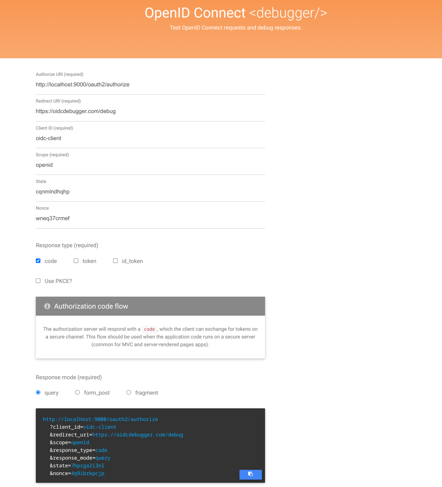
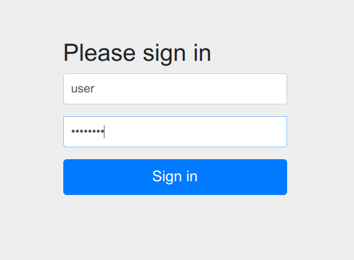
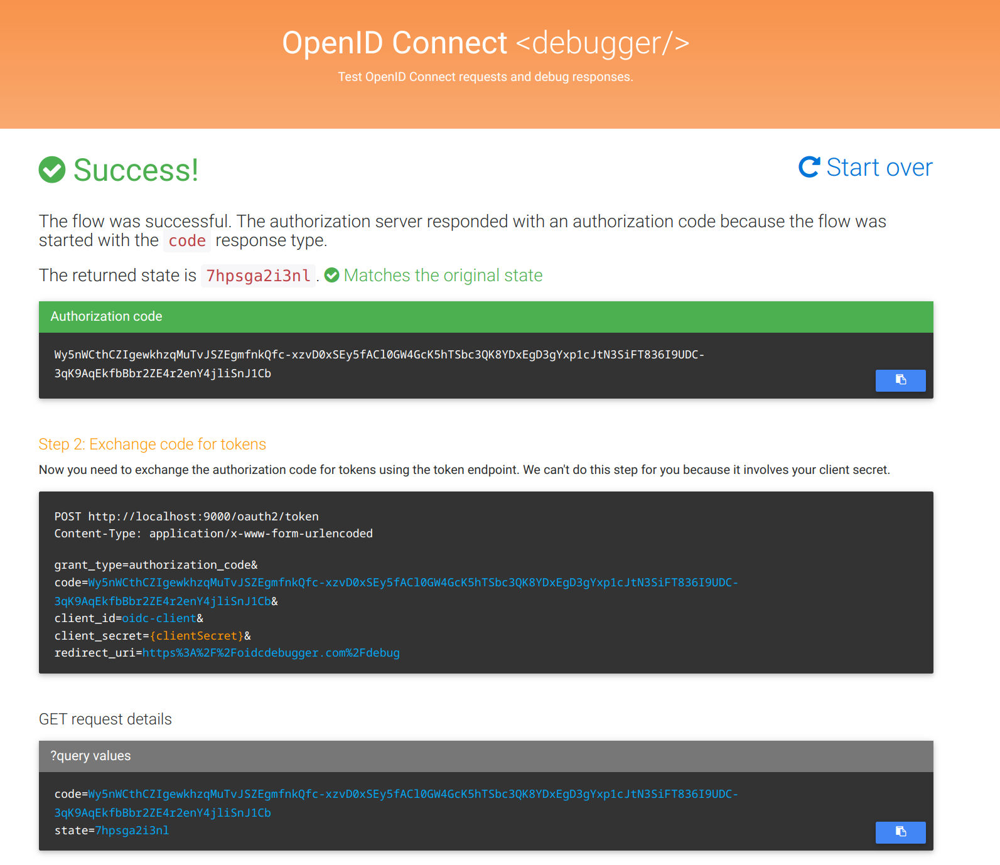

### Configuration Endpoint

<http://localhost:9000/.well-known/oauth-authorization-server>

### Test with OpenID Connect

##### Redirect to Authorization server
user: user

password: password

##### After authentication will return Authorization code

